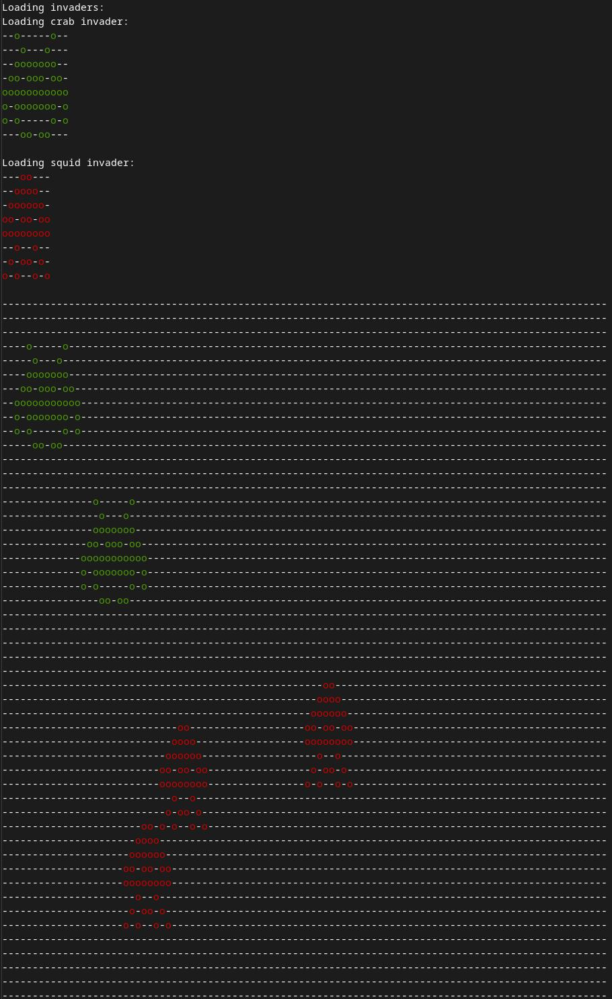

# Invaders::Radar

Invaders are upon us! This is a gem that will help detect invaders in a radar sample. Check [invaders and radar specifications](SPACE-INVADERS-RADAR.md)

There are two kinds of detector:
* Exact detector: Will detect invaders that are a exact match of the specification (positive and negative space)
* Shape detector: Will detect invaders by its positive space. Colliding invader detections will be given a lower accuracy and will be shown in dimmer color than the 100% accuracy.

! In this directory, you'll find the files you need to be able to package up your Ruby library into a gem. Put your Ruby code in the file `lib/invaders/radar`. To experiment with that code, run `bin/console` for an interactive prompt.

## Usage:
(use `bundle exec` if gem is not installed: `bundle exec invaders-radar -r snapshot_example.txt`)

Invaders radar exec will take 3 options:
* Radar sample: Use "-r", "--radar-sample". It is mandatory to use a radar sample to the radar. `invaders-radar -r snapshot_example.txt`
* Detection strategy: Use "-s", "--strategy". Default strategy is `exact`. Can switch between `exact` and `shape`:
  - Exact: matches positive and negative space. `invaders-radar -r snapshot_shape.txt -s exact`
  - Shape: will match positive space, possible collisions will lower its accuracy to 0.8 `invaders-radar -r snapshot_shape.txt -s shape`
* Accuracy: Use "-a", "--accuracy", Only works with shape. If given it will show possible matches with a equals or above certain accuracy given to the detection. `invaders-radar -r snapshot_collision.txt --accuracy 0.8 -s shape`

Use different files examples with different detection strategies and accuracy:
* snapshot_collide.txt See what happens between exact matcher and shape matcher
* snapshot_collision.txt See what happens using shape and accuracy between 1 and 0.8
* snapshot_corners.txt See corner detection.
* snapshot_exact.txt Simple exact match problem
* snapshot_example.txt Example provided.
* snapshot_shape.txt See what happens between exact matcher and shape matcher

## Development
After checking out the repo, run `bin/setup` to install dependencies. Then, run `rake spec` to run the tests. You can also run `bin/console` for an interactive prompt that will allow you to experiment.

### Runtime dependencies:
Using:

* [Pastel](https://github.com/piotrmurach/pastel) to paint in the terminal with style
* [Slop](https://github.com/leejarvis/slop) to help with the CLI arguments.

### Development dependencies:
Using:
* [Rspec](https://rspec.info/) For testing.
* [Rubocop](https://github.com/rubocop/rubocop) to check code style with [Rubocop-rspec](https://github.com/rubocop/rubocop-rspec) and [Rubocop-rake](https://github.com/rubocop/rubocop-rake)
* [Guard](https://github.com/guard/guard) to monitor filesystem changes and help with the red/green development flow. `bundle exec guard`. Used with a couple of plugins for [rspec](https://github.com/guard/guard-rspec) and [rubocop](https://github.com/rubocop/guard-rubocop)
* [Simplecov](https://github.com/simplecov-ruby/simplecov) to check code coverage.

### Installation and release
To install this gem onto your local machine, run `bundle exec rake install`. To release a new version, update the version number in `version.rb`, and then run `bundle exec rake release`, which will create a git tag for the version, push git commits and the created tag, and push the `.gem` file to [rubygems.org](https://rubygems.org).

## Installation

Install the gem and add to the application's Gemfile by executing:

    $ bundle add invaders-radar

If bundler is not being used to manage dependencies, install the gem by executing:

    $ gem install invaders-radar

## Contributing

Bug reports and pull requests are welcome on GitHub at https://github.com/barrerajl/invaders-radar.
